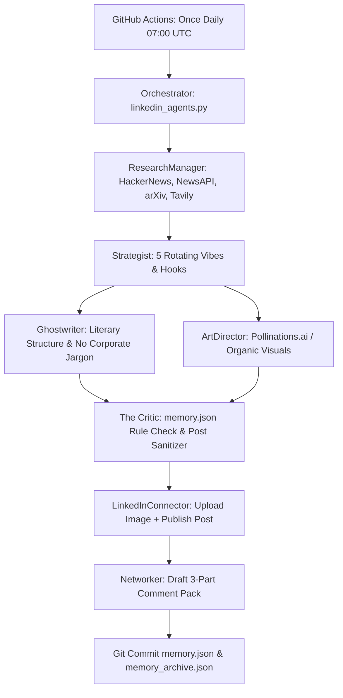

# Handoff Pack: LinkedIn Growth Bot (Autonomous GitHub Actions Engine)

> **Audience**: Grok Bot / Successor Engineer  
> **Repository**: `theriskofcollision/linkedin-post-twice-daily`  
> **Maintainer / Subject**: Hakan Köse (Agentic AI Expert)  
> **Last Verified**: September 2026  

---

## 1. Executive Summary & Bot Architecture

This repository runs an autonomous multi-agent content generation and publishing system for LinkedIn, running inside **GitHub Actions**. It researches trending AI breakthroughs, formulates high-engagement angles, drafts punchy LinkedIn posts, creates visual assets, applies editorial quality control, publishes to LinkedIn via API, generates networking comment packs, and commits updated state to `memory.json`.



### Core Agents in `linkedin_agents.py`
1. **Orchestrator (`Orchestrator`)**: Coordinates the pipeline, selects dynamic personas ("Vibes"), formats, and handles error recovery.
2. **ResearchManager (`ResearchManager`)**: Scours HackerNews (free/public Algolia API), arXiv (public API), NewsAPI (`NEWS_API_KEY`), and Tavily (`TAVILY_API_KEY`).
3. **Strategist (`Strategist`)**: Determines hook and angle aligned with Hakan's persona (Technical, builder mindset, "The future is agentic") across 5 vibes (*The Contrarian*, *The Visionary*, *The Educator*, *The Analyst*, *The Anthropologist*).
4. **Ghostwriter (`Ghostwriter`)**: Drafts the post under 1500 characters using punchy formatting, bullet points, and strong takeaways.
5. **ArtDirector (`ArtDirector`) & Visuals**: Generates cyber/minimalist visual prompts rendered via Pollinations.ai (no API key required) or falls back to curated organic visuals (`OrganicImageSearcher`).
6. **The Critic (`Critic`)**: Harsh editor that checks drafts against past banned phrases stored in `memory.json` (e.g., bans "Funny thing", "Honestly", "delve", asterisk markdown spam).
7. **Networker (`Networker`)**: Generates 3 ready-to-use comments (*Value Add*, *Contrarian*, *Question*) stored in `memory.json` for manual engagement with industry peers.
8. **LinkedInConnector (`LinkedInConnector`)**: Authenticates via OAuth 2.0 Bearer token and publishes image + commentary to LinkedIn.

---

## 2. Current State & Recent Changes

| Component | Previous State | Current State (Sep 2026) | Action Required by Grok Bot |
|---|---|---|---|
| **Schedule** | Twice daily (`0 7,14 * * *`) | **Once daily** at `07:00 UTC` (`10:00 Istanbul`) | Update `.github/workflows/linkedin_scheduler.yml` cron to `'0 7 * * *'` |
| **LLM Provider** | Gemini / Groq | **Groq API** (`GROQ_API_KEY`) | Keep Groq client; verify secret in GitHub |
| **Groq Model** | `llama-3.3-70b-versatile` | **Retired in Aug 2026** on Groq dev tiers | Change model in `config.yaml` to `openai/gpt-oss-120b` |
| **LinkedIn Publish** | Succeeded through May 2026 | **Fails with 401 Unauthorized** | Fix app verification, token minting, and endpoints |
| **Active App** | "hakan growth bot" (unverified) | Switch to **"github 1"** (has OIDC + Share) | Complete setup on "github 1" |
| **Target Scope** | Personal Profile (`w_member_social`) | Personal Profile (`w_member_social`) | Do NOT target organization pages yet |

---

## 3. Environment Variables & GitHub Secrets

> [!CAUTION]
> **NEVER** print, log, or commit secret values. All secrets must be stored exclusively in GitHub Repository Secrets (**Settings > Secrets and variables > Actions**).

### Required Secrets
| Secret Name | Consumed By | Purpose / Notes |
|---|---|---|
| `GROQ_API_KEY` | `Agent.run` (`linkedin_agents.py:L282`) | Authentication for Groq LLM inference. |
| `LINKEDIN_ACCESS_TOKEN` | `LinkedInConnector.__init__` (`linkedin_agents.py:L1164`) | 60-day OAuth 2.0 Bearer token. |
| `LINKEDIN_PERSON_URN` | `LinkedInConnector.__init__` (`linkedin_agents.py:L1165`) | Author URN: `urn:li:person:{id}`. |

### Optional / Fallback Secrets
| Secret Name | Consumed By | Status |
|---|---|---|
| `NEWS_API_KEY` | `NewsApiConnector.get_top_ai_news` | Optional. If missing, HackerNews + arXiv provide sufficient intel. |
| `TAVILY_API_KEY` | `TavilyConnector.search_ai_context` | Optional. Deep-search contextual fallback. |
| `FORCED_VIBE` | `Orchestrator._select_vibe_and_format` | Optional override (e.g. `The Contrarian`). If empty, chooses randomly. |

---

## 4. How LinkedIn Auth Works in 2026

### 4.1. Developer App Selection & Products
LinkedIn enforces strict product-to-permission mapping:
- **App Recommendation**: Use **"github 1"**.
  - **"hakan growth bot"** lacked OpenID Connect, had an unverified company page association, missing business email, and placeholder privacy policy.
  - **"github 1"** already has both required products enabled:
    1. **Share on LinkedIn** &rarr; grants `w_member_social`
    2. **Sign In with LinkedIn using OpenID Connect** &rarr; grants `openid`, `profile`, `email`
- **Required Scopes for Personal Posting**:
  `openid profile email w_member_social`
- **Author URN Format**:
  `urn:li:person:{sub}` where `{sub}` is the OpenID subject identifier returned from `/v2/userinfo`.

### 4.2. Legacy `/v2/` vs Modern `/rest/` Endpoints
- **Legacy v2 API (`/v2/ugcPosts`, `/v2/assets`, `/v2/me`)**:
  - `/v2/me` is **deprecated** and permanently returns `401 Unauthorized: INVALID_ACCESS_TOKEN` for apps that only have OIDC products (it required legacy `r_liteprofile`).
  - `/v2/userinfo` is the **official replacement** for profile identification in OIDC apps.
  - While `linkedin_agents.py` currently calls `https://api.linkedin.com/v2/ugcPosts` and `/v2/assets?action=registerUpload`, LinkedIn's modern standard is the REST API (`/rest/posts` and `/rest/images?action=initializeUpload`).
- **REST API Header Requirements**:
  ```http
  Authorization: Bearer <TOKEN>
  LinkedIn-Version: 202606
  X-Restli-Protocol-Version: 2.0.0
  Content-Type: application/json
  ```

---

## 5. Root-Cause Analysis: Why `INVALID_ACCESS_TOKEN` / 401 Occurs

When manual runs fail at publish or curl tests return `INVALID_ACCESS_TOKEN`, investigate these exact root causes:

1. **Testing Against Deprecated `/v2/me`**:
   - Calling `https://api.linkedin.com/v2/me` with a token generated via OIDC (`openid`, `profile`, `email`) **always fails with 401**. The developer app does not have `r_liteprofile`.
   - **Fix**: Use `https://api.linkedin.com/v2/userinfo`.
2. **Missing Scopes in Developer Token Generator**:
   - In the [LinkedIn Token Generator](https://www.linkedin.com/developers/tools/oauth/token-generator), selecting the app is not enough; the user must check **all 4 checkboxes**: `openid`, `profile`, `email`, `w_member_social`. If `openid` is unchecked, `/v2/userinfo` returns 401. If `w_member_social` is unchecked, `/rest/posts` returns 401/403.
3. **Unverified Company Page Association**:
   - In LinkedIn Developer Portal, even if creating personal posts, the app must link to a LinkedIn Page. If that page association has an "Action Required / Pending Verification" banner, LinkedIn blocks live API token calls. The Page Admin must click the verification link generated in Developer Portal Settings.
4. **Developer Role Missing on App**:
   - Apps in "Development" mode only allow API calls from members listed in **Auth > App Roles** (Admins or Developers). If the token is generated by a profile not explicitly added as an App Team Member, it fails.
5. **Shell Variable / Whitespace Pitfall**:
   - Running `curl -H "Authorization: Bearer $LINKEDIN_ACCESS_TOKEN"` in terminal fails with 401 if the variable is not exported (`export LINKEDIN_ACCESS_TOKEN="..."`).
   - Copy-pasting the token from the web UI often copies leading/trailing spaces or quotes.
6. **Missing or Outdated Version Header on REST Endpoints**:
   - Calling `/rest/posts` or `/rest/images` without a supported `LinkedIn-Version: YYYYMM` (currently `202606`) returns 400/401/426 from LinkedIn's gateway.

---

## 6. Grok Bot Priority Checklist

### What Grok Bot Should Fix First (P0)
1. [ ] **Verify "github 1" Developer App in LinkedIn Portal**:
   - Ensure Company Page association is verified.
   - Verify products: **Share on LinkedIn** + **Sign In with LinkedIn using OpenID Connect**.
   - Verify Hakan is listed as an **App Administrator** or **Developer** under Auth roles.
2. [ ] **Mint Fresh Token via Token Generator**:
   - Check all 4 scopes: `openid`, `profile`, `email`, `w_member_social`.
3. [ ] **Validate Token via Terminal & Extract Person URN**:
   - Run `GET https://api.linkedin.com/v2/userinfo`.
   - Extract `sub` value &rarr; set URN as `urn:li:person:{sub}`.
4. [ ] **Update GitHub Repository Secrets**:
   - `LINKEDIN_ACCESS_TOKEN` = fresh token.
   - `LINKEDIN_PERSON_URN` = `urn:li:person:{sub}`.
   - `GROQ_API_KEY` = valid Groq API key.
5. [ ] **Trigger Manual Actions Run & Verify**:
   - The codebase has already been migrated to REST APIs (`/rest/posts` and `/rest/images?action=initializeUpload`) with `LinkedIn-Version: 202606`. Trigger `workflow_dispatch` to confirm successful publication.

### What Grok Bot Should LEAVE ALONE (P2 / P3)
- **Do NOT touch Agent Prompts or Vibes**: The 5 personas, prompt constraints, and literary structure work effectively.
- **Do NOT alter The Critic or Memory Sanitizer**: The anti-AI sanitization (asterisk removal, banned phrases) is tested and prevents low-quality posts.
- **Do NOT enable "The Healer" / Stats API for Personal Profiles**: `r_member_social` is restricted by LinkedIn for personal profiles. `features.enable_healer` must remain `false`.
- **Do NOT change Image Generation**: Pollinations.ai runs without API keys or costs.
- **Do NOT attempt Company Page migration yet**: The stated goal is personal profile growth.

---

## 7. Future Strategic Horizon: The Content Triangle

Once personal profile posting is stable:
1. **GitHub Repository**: Open source agent frameworks and real code examples.
2. **Website (`hakankose.com`)**: Long-form architectural writeups and project deep-dives.
3. **LinkedIn**: Fast-paced, daily scroll-stopping hooks driving traffic to the repository and website.
